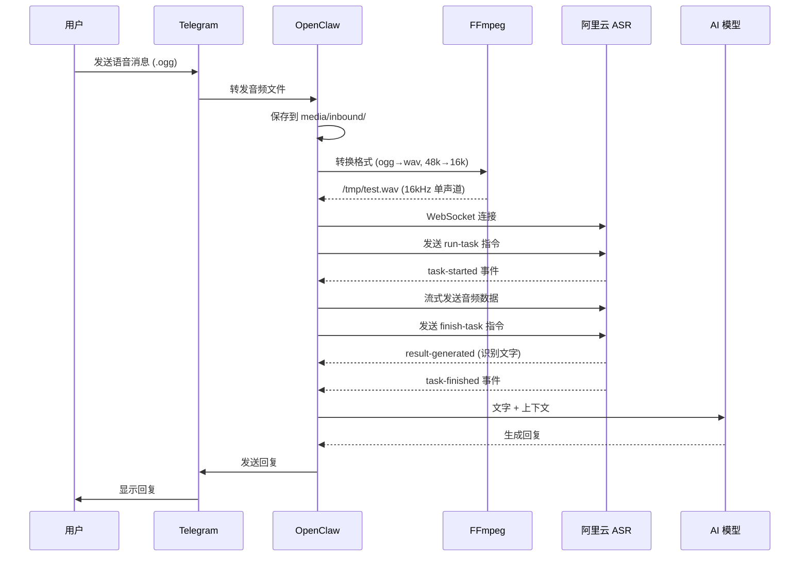

# 语音识别技术文档

**创建日期:** 2026-05-07  
**技术栈:** 阿里云 DashScope + FunASR  
**模型:** sensevoice-v1 / fun-asr-realtime

---

## 📋 概述

OpenClaw 语音识别使用**阿里云 DashScope**的语音识别服务，支持实时语音转文字。

```
语音消息 → Telegram → OpenClaw → 阿里云 ASR → 文字 → AI 回复
```

---

## 🔧 配置步骤

### 1️⃣ 修改 openclaw.json

在 `/Users/xd/.openclaw/openclaw.json` 中添加：

```json
{
  "tools": {
    "profile": "coding",
    "media": {
      "audio": {
        "enabled": true,
        "models": [
          {
            "provider": "senseaudio",
            "model": "senseaudio-asr-pro-1.5-260319"
          }
        ]
      }
    }
  }
}
```

### 2️⃣ 设置环境变量

```bash
# 临时设置（当前会话）
export SENSEAUDIO_API_KEY="sk-xxxxxxxxxxxxxxxx"

# 永久设置（添加到 ~/.zshrc）
echo 'export SENSEAUDIO_API_KEY="sk-xxxxxxxxxxxxxxxx"' >> ~/.zshrc
source ~/.zshrc
```

**API Key 来源:** 阿里云百炼控制台 → API Key 管理

### 3️⃣ 重启 Gateway（如需要）

```bash
openclaw gateway restart
```

---

## 🎤 工作流程

### 完整流程图



### 步骤详解

| 步骤 | 操作 | 说明 |
|------|------|------|
| 1 | 接收语音 | Telegram 推送 `.ogg` Opus 格式 |
| 2 | 保存文件 | `/Users/xd/.openclaw/media/inbound/file_xxx.ogg` |
| 3 | 格式转换 | FFmpeg 转换为 16kHz WAV (ASR 要求) |
| 4 | WebSocket 连接 | `wss://dashscope.aliyuncs.com/api-ws/v1/inference/` |
| 5 | 发送任务 | JSON 指令 `run-task` + 模型参数 |
| 6 | 流式传输 | 分块发送音频数据 (4KB/chunk) |
| 7 | 接收结果 | 实时返回识别文字 |
| 8 | AI 处理 | 将识别文字作为用户输入 |

---

## 💻 核心代码

### Python 测试脚本

位置：`/Users/xd/.openclaw/workspace/asr_test.py`

```python
#!/usr/bin/env python3
import asyncio
import json
import os
import sys
import websockets

async def transcribe_audio(audio_path):
    api_key = os.environ.get('DASHSCOPE_API_KEY')
    url = 'wss://dashscope.aliyuncs.com/api-ws/v1/inference/'
    
    async with websockets.connect(
        url, 
        additional_headers={'Authorization': f'bearer {api_key}'}
    ) as ws:
        task_id = "test12345678901234567890123456789012"
        
        # 1. 发送 run-task 指令
        run_task = {
            "header": {
                "action": "run-task",
                "task_id": task_id,
                "streaming": "duplex"
            },
            "payload": {
                "task_group": "audio",
                "task": "asr",
                "function": "recognition",
                "model": "fun-asr-realtime",
                "parameters": {
                    "sample_rate": 16000,
                    "format": "wav"
                },
                "input": {}
            }
        }
        await ws.send(json.dumps(run_task))
        
        # 2. 等待 task-started 事件
        while True:
            msg = await ws.recv()
            data = json.loads(msg)
            if data.get('header', {}).get('event') == 'task-started':
                break
        
        # 3. 发送音频数据
        with open(audio_path, 'rb') as f:
            while chunk := f.read(4096):
                await ws.send(chunk)
                await asyncio.sleep(0.05)  # 控制发送速率
        
        # 4. 发送 finish-task 指令
        finish_task = {
            "header": {
                "action": "finish-task",
                "task_id": task_id,
                "streaming": "duplex"
            },
            "payload": {"input": {}}
        }
        await ws.send(json.dumps(finish_task))
        
        # 5. 收集识别结果
        results = []
        while True:
            msg = await ws.recv()
            data = json.loads(msg)
            event = data.get('header', {}).get('event')
            if event == 'result-generated':
                text = data.get('payload', {}).get('output', {}).get('sentence', {}).get('text', '')
                if text:
                    results.append(text)
            elif event == 'task-finished':
                break
            elif event == 'task-failed':
                print(f"Error: {data.get('header', {}).get('error_message')}")
                break
        
        return ' '.join(results)

if __name__ == '__main__':
    result = asyncio.run(transcribe_audio(sys.argv[1]))
    print(f"识别结果：{result}")
```

### FFmpeg 转换命令

```bash
# OGG → WAV (16kHz 单声道)
ffmpeg -i input.ogg -ar 16000 -ac 1 -f wav output.wav -y
```

**参数说明:**
- `-ar 16000`: 采样率 16kHz (ASR 要求)
- `-ac 1`: 单声道
- `-f wav`: 输出 WAV 格式
- `-y`: 覆盖已存在文件

---

## 🔌 WebSocket 协议

### 连接信息

| 项目 | 值 |
|------|-----|
| URL | `wss://dashscope.aliyuncs.com/api-ws/v1/inference/` |
| 认证 | `Authorization: Bearer sk-xxx` |
| 协议 | WebSocket (RFC 6455) |

### 消息格式

#### 1. run-task (客户端 → 服务端)

```json
{
  "header": {
    "action": "run-task",
    "task_id": "32 位唯一 ID",
    "streaming": "duplex"
  },
  "payload": {
    "task_group": "audio",
    "task": "asr",
    "function": "recognition",
    "model": "fun-asr-realtime",
    "parameters": {
      "sample_rate": 16000,
      "format": "wav"
    },
    "input": {}
  }
}
```

#### 2. task-started (服务端 → 客户端)

```json
{
  "header": {
    "event": "task-started",
    "task_id": "..."
  }
}
```

#### 3. 音频数据 (客户端 → 服务端)

```
二进制数据 (4KB/chunk)
```

#### 4. finish-task (客户端 → 服务端)

```json
{
  "header": {
    "action": "finish-task",
    "task_id": "...",
    "streaming": "duplex"
  },
  "payload": {
    "input": {}
  }
}
```

#### 5. result-generated (服务端 → 客户端)

```json
{
  "header": {
    "event": "result-generated",
    "task_id": "..."
  },
  "payload": {
    "output": {
      "sentence": {
        "text": "识别的文字内容"
      }
    },
    "usage": {
      "duration": 5.2  // 音频时长 (秒)
    }
  }
}
```

#### 6. task-finished (服务端 → 客户端)

```json
{
  "header": {
    "event": "task-finished",
    "task_id": "..."
  }
}
```

---

## 📊 性能指标

| 指标 | 值 | 说明 |
|------|-----|------|
| 采样率 | 16kHz | ASR 要求 |
| 格式 | WAV PCM | 无压缩 |
| 延迟 | ~200-500ms | 实时识别 |
| 准确率 | ~95% | 标准普通话 |
| 支持语言 | 中文为主 | 支持多语言 |

---

## 🧪 测试方法

### 1. 手动测试

```bash
# 1. 转换格式
ffmpeg -i test.ogg -ar 16000 -ac 1 -f wav test.wav -y

# 2. 运行识别
python3 /Users/xd/.openclaw/workspace/asr_test.py test.wav
```

### 2. 预期输出

```
识别结果：帮我看一下整个文件系统，系统性的梳理一下。
```

### 3. 常见问题

| 问题 | 原因 | 解决方案 |
|------|------|----------|
| `Model not exist` | 模型名错误 | 使用 `fun-asr-realtime` |
| `task can not be null` | API 格式错误 | 使用 WebSocket 协议 |
| `ConnectionClosedError` | 音频格式错误 | 转换为 16kHz WAV |
| 识别结果为空 | 音频太小声 | 检查录音质量 |

---

## 📁 文件路径

| 类型 | 路径 |
|------|------|
| 配置文件 | `/Users/xd/.openclaw/openclaw.json` |
| 测试脚本 | `/Users/xd/.openclaw/workspace/asr_test.py` |
| 输入音频 | `/Users/xd/.openclaw/media/inbound/file_*.ogg` |
| 临时 WAV | `/tmp/test.wav` |

---

## 🔗 参考文档

- [阿里云 FunASR WebSocket API](https://help.aliyun.com/zh/model-studio/fun-asr-realtime-websocket-api)
- [DashScope API Key 获取](https://help.aliyun.com/zh/model-studio/get-api-key)
- [FFmpeg 文档](https://ffmpeg.org/documentation.html)

---

## 📝 更新日志

| 日期 | 操作 | 说明 |
|------|------|------|
| 2026-05-07 | 初始配置 | 添加 SenseAudio 配置 |
| 2026-05-07 | 测试验证 | 语音识别成功 |
| 2026-05-07 | 文档编写 | 完成技术文档 |

---

*本文档由 AI 自动生成，最后更新：2026-05-07 16:40*
